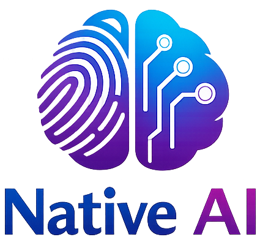

<p align="center">
  
</p>

<h1 align="center">Native AI</h1>

<p align="center">
  A fully offline AI chat application built with React Native and Expo.<br/>
  Runs local LLMs directly on-device using <a href="https://github.com/nicepkg/llama.rn">llama.rn</a> — no internet required.
</p>

## Features

- **Fully offline** — no API calls, no backend, works in airplane mode
- **On-device LLM** — runs GGUF models locally via llama.rn
- **Streaming responses** — token-by-token AI output
- **Multi-chat** — create, rename, delete conversations
- **Dark/Light theme** — system detection + manual toggle
- **Persistent storage** — conversations saved with MMKV
- **Markdown rendering** — code blocks, formatting in AI responses
- **Privacy-first** — your data never leaves your device

## Tech Stack

- React Native (Expo SDK 54)
- TypeScript (strict mode)
- NativeWind v4 (Tailwind CSS)
- Redux Toolkit + redux-persist + MMKV
- llama.rn (on-device GGUF inference)
- Expo Router (file-based navigation)
- React Native Reanimated (animations)

## Getting Started

### Prerequisites

- Node.js 18+
- Bun (package manager)
- Android Studio (for Android builds)
- A GGUF model file (e.g., Phi-3-mini, TinyLlama)

### Installation

```bash
# Clone the repo
git clone <repo-url>
cd MyAI

# Install dependencies
bun install

# Start development server
bun run start
```

### Running on Device

```bash
# Android
bun run android

# iOS (macOS only)
bun run ios
```

### Loading a Model

1. Download a GGUF model file (recommended: 1-3GB for mobile)
2. Open the app → Settings → AI Model → Load Model
3. Select the .gguf file from your device
4. Wait for loading to complete
5. Start chatting!

### Recommended Models

| Model | Size | Quality |
|-------|------|---------|
| Phi-3-mini Q4_K_M | ~2.3GB | Good |
| TinyLlama 1.1B Q4_K_M | ~0.7GB | Basic |
| Llama-3.2-1B Q4_K_M | ~0.8GB | Good |

## Scripts

```bash
bun run start        # Start Expo dev server
bun run android      # Run on Android
bun run ios          # Run on iOS
bun run web          # Run on web
bun run typecheck    # TypeScript check
bun run lint         # ESLint
bun run lint:fix     # ESLint auto-fix
bun run format       # Prettier format
bun run test         # Run tests
bun run test:watch   # Run tests in watch mode
```

## Project Structure

```
MyAI/
├── app/                    # Expo Router screens
│   ├── _layout.tsx         # Root layout (providers)
│   └── (drawer)/           # Drawer navigation group
│       ├── _layout.tsx     # Drawer config
│       ├── index.tsx       # Home (new chat)
│       ├── chat/[id].tsx   # Chat screen
│       └── settings.tsx    # Settings screen
├── components/
│   ├── chat/               # Chat UI components
│   └── common/             # Shared components
├── hooks/                  # Custom React hooks
├── lib/
│   ├── ai/                 # LLM integration layer
│   ├── storage/            # MMKV persistence
│   └── utils/              # Utility functions
├── store/                  # Redux Toolkit slices
├── types/                  # TypeScript interfaces
├── constants/              # App constants & theme
└── __tests__/              # Test suites
```

## Building for Production

```bash
# Install EAS CLI
bun add -g eas-cli

# Build Android APK
eas build --platform android --profile preview

# Build production
eas build --platform android --profile production
```

## Constraints

- No cloud AI APIs (OpenAI, Claude, etc.)
- No server/database dependency
- Must work in airplane mode
- Optimized for mid-range Android devices (4GB+ RAM)

## License

Private project.
